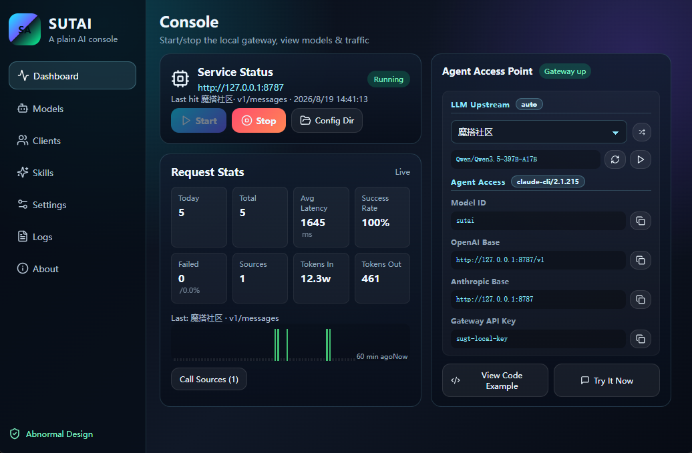
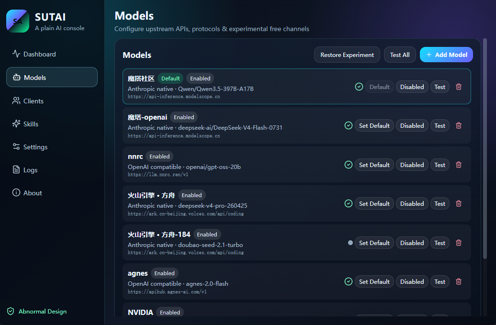
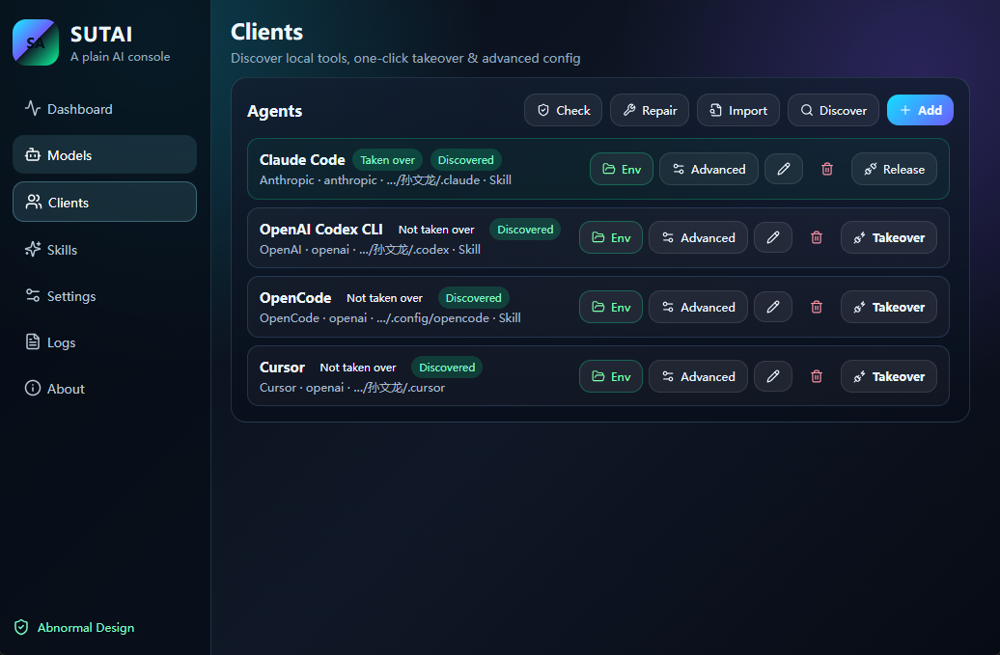
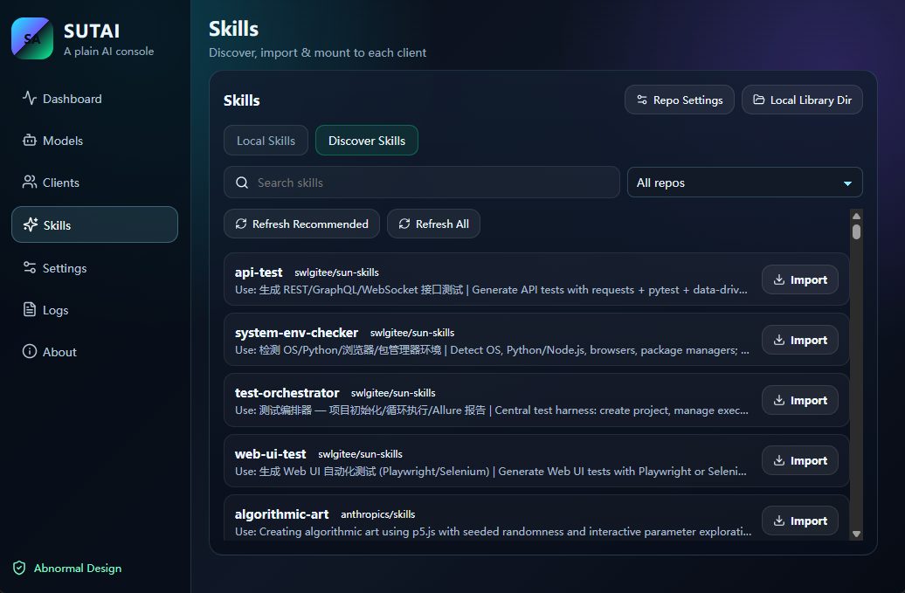
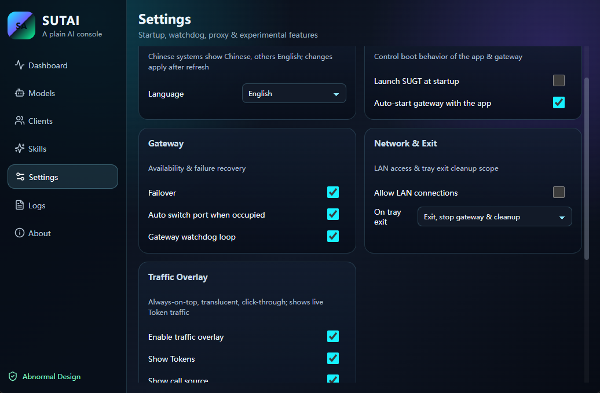
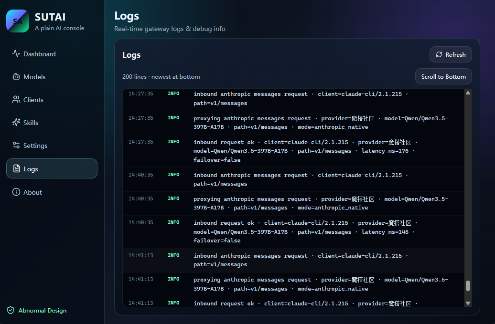

# SUGT

A local AI gateway and skill control plane for your desktop. SUGT centralizes API keys from multiple LLM providers behind a single OpenAI / Anthropic-compatible proxy, so Claude Code, Codex, OpenCode, and other AI coding clients all talk to one local endpoint — while you swap upstream models (official APIs, Chinese providers, self-hosted models) in a single panel. It also ships a Skills console for discovering, installing, and mounting Skills without losing your library.

- **One key set, everywhere**: Base URLs and auth are consolidated into one local gateway.
- **Swap upstreams freely**: OpenAI, Anthropic, ModelScope, Volcengine, SiliconFlow, or your own models — no client-side reconfiguration.
- **Skills that stick**: discover, install, and mount Skills; unmounting never loses your library.

|                |                                                                       |
| -------------- | --------------------------------------------------------------------- |
| Version        | 1.1.1                                                                 |
| Author         | Sun Wenlong · 异常设计                                                 |
| Open source    | [Apache-2.0](LICENSE), fully open source                               |
| Releases       | [GitHub Releases](https://github.com/lsuen/sugt/releases)              |

中文说明：[README.md](README.md)

## Why

- **API keys scattered** across OpenAI, Anthropic, ModelScope, Volcengine, local models…
- **Every agent wants its own Base URL and auth setup** — re-editing configs in each client is tedious and error-prone
- **Skills live in different folders** with no shared discover / mount / keep flow; switching machines means redoing everything

SUGT is intentionally small: a compatible local gateway, one-click takeover for common agents, and a skill control plane you can actually keep.

## Features

### Local AI Gateway

- Axum HTTP server embedded in the Tauri process, speaking **OpenAI Chat Completions**, **Anthropic Messages**, and **OpenAI Responses**
- **Protocol bridging**: bidirectional request / response conversion between Anthropic and OpenAI, including SSE streaming
- **Multi-upstream failover**: automatically falls back to the next provider in your `failover` order
- **Hot-reload config**: edit `config.toml` and the next request picks it up — no restart needed
- **Port fallback**: if the configured port is taken, the gateway binds the next available one
- Built-in endpoints: `/health`, `/v1/models`, `/v1/_sugt/traffic`

### Model Management

- Built-in catalog of Chinese providers (ModelScope, Volcengine, SiliconFlow, and more) with standard Base URLs and model lists
- Enable / disable providers, switch the default model, and test connectivity from one panel

### One-Click Agent Takeover

- Automatically discovers installed agent clients on your machine
- Sets environment variables and launch scripts so Claude Code / Codex / OpenCode point at the local gateway; releasing the takeover cleans everything up

### Skills Console

- Refresh skill indexes from Git repositories, Gitee, or custom sources
- Install, uninstall, mount, and unmount Skills — your library is always preserved
- Mount the same Skill across multiple agents; Markdown-rendered skill panels

### Traffic Overlay

- Always-on-top, semi-transparent, mouse-through overlay showing today's token activity in real time
- Landscape / portrait layout, resizable, with one-click restore to defaults

### Gateway Watchdog

- Detects gateway unavailability every 20 seconds and restarts it automatically
- Manages a detached `sugt-cli serve` process via PID file (no window, background-only)

## Screenshots

Console — start/stop, traffic, agent endpoints.



Models — providers, default model, connectivity test.



Clients — discover agents, take over or release.



Skills — local mount and repo discovery.



Settings — language, gateway, and overlay options.



Logs — request and gateway activity.



## Internationalization

SUGT ships with built-in **English / 中文** support. All UI text is rendered through a single dictionary layer with zero third-party dependencies.

**Switching languages**: open **Settings** → **Language** and pick one of:

| Option | Behavior |
| --- | --- |
| Follow system | Uses the OS language: Chinese systems show 中文, everything else shows English (default) |
| 中文 | Always shows Chinese |
| English | Always shows English |

The UI refreshes immediately after switching — every panel, dialog, toast, and the traffic overlay updates with no gaps. The choice is persisted locally and survives restarts.

**Implementation notes**:

- All copy lives in the `zh` / `en` dictionaries in `src/i18n.ts`; components read it via `t('namespace.key')`
- `{variable}` interpolation is supported for dynamic text (token counts, provider names, paths)
- The preference is stored in `localStorage`, consistent with theme and other UI preferences
- Adding a new language is a dictionary extension — no component changes required

## Getting Started

### Install

Download the Windows x64 installer from [GitHub Releases](https://github.com/lsuen/sugt/releases) and run it.

Configuration defaults to `Documents\.sugt\`; override with the `SUGT_CONFIG_DIR` environment variable.

### CLI

```cmd
sugt-cli status
sugt-cli serve --host 127.0.0.1 --port 8787
sugt-cli env        # takeover management
sugt-cli test       # connectivity test
```

## Build from Source

Requirements: Windows 10/11, Node 18+, Rust 1.78+, WebView2 runtime.

```cmd
npm install
npm run check        # TypeScript type check
npm run dev:app      # launch the Tauri app in dev mode
```

Production build:

```cmd
npm run build        # frontend production build
npx tauri build      # full desktop bundle
cd src-tauri && cargo build --release --bin sugt-cli   # standalone CLI
```

## Tech Stack

| Layer | Choice |
| --- | --- |
| Desktop shell | Tauri 2.9 (WebView2) |
| Frontend | React 18 + TypeScript 5.7 + Vite 6 |
| Backend | Rust (edition 2021) + Axum 0.7 |
| Gateway | Embedded Axum HTTP server, OpenAI / Anthropic protocol bridging |
| CLI | `sugt-cli` (standalone binary: `serve` / `status` / `test` / `env` / `init`) |

## Feedback & Contributions

Questions and suggestions are welcome — open an [Issue](https://github.com/lsuen/sugt/issues). The project is under active polish; a star is the best encouragement.

## License

[Apache-2.0](LICENSE) · [NOTICE](NOTICE)
