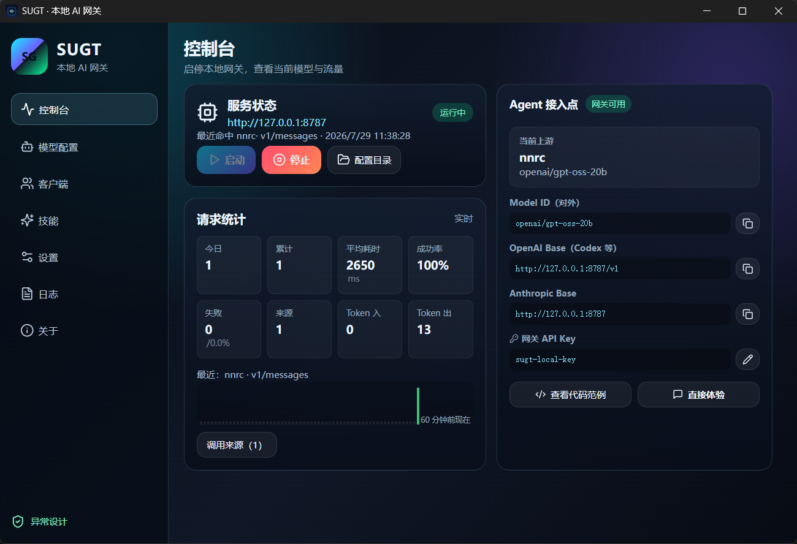
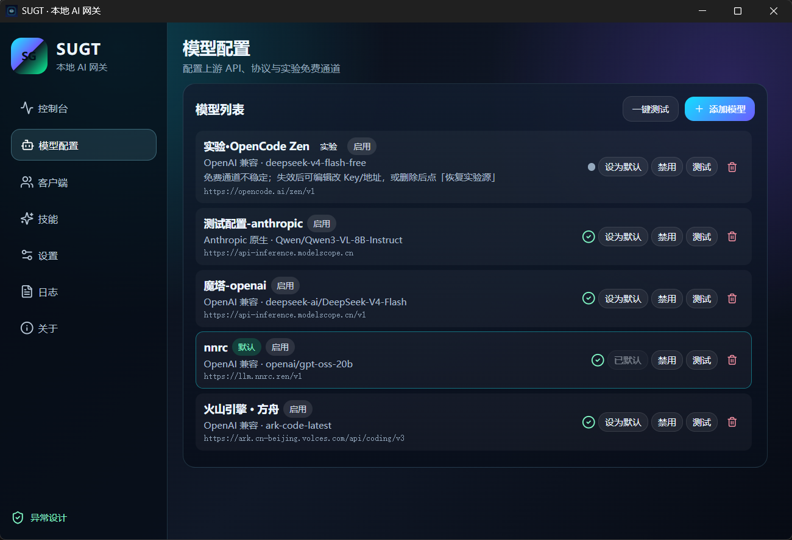
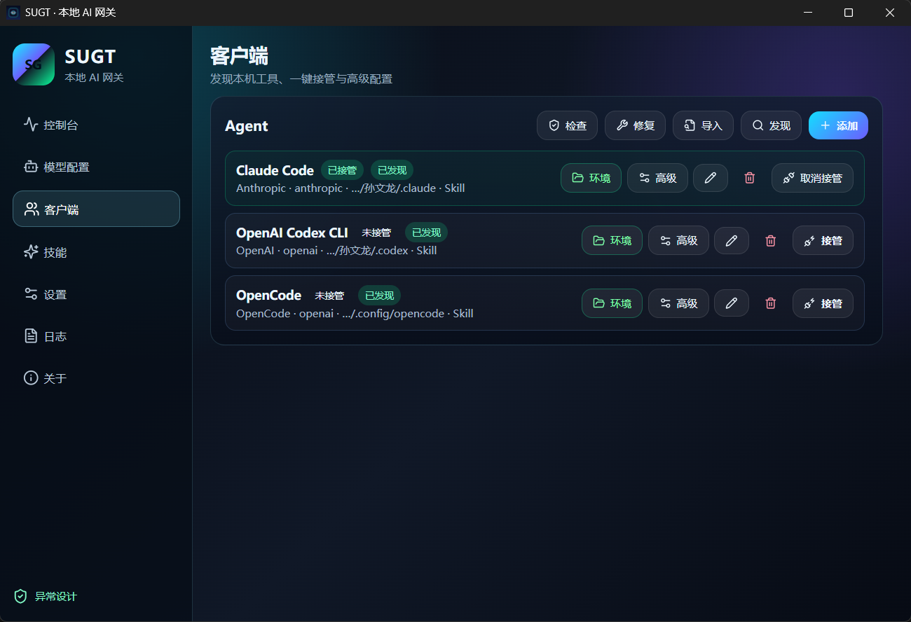
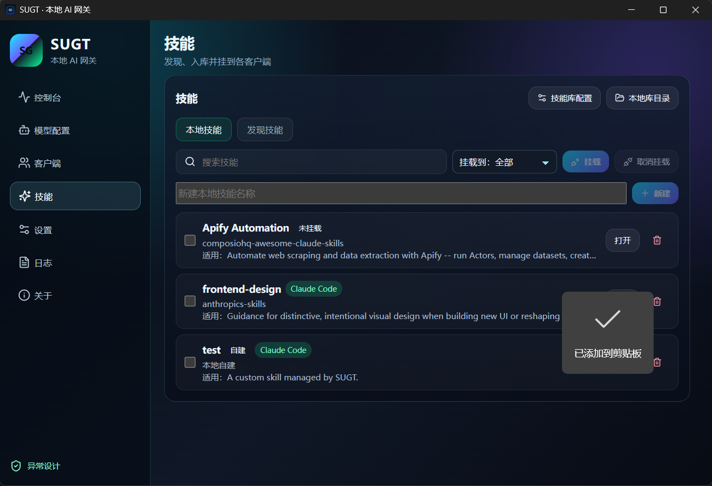
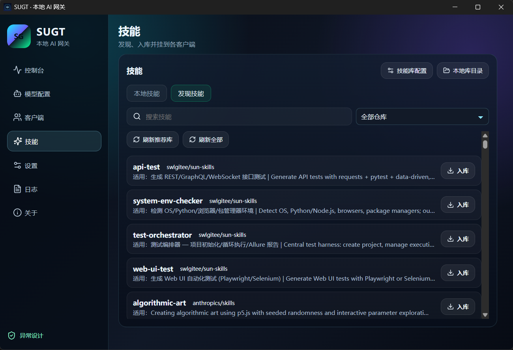

# SUGT

本地 AI 网关。把模型 Key、Agent 接管、Skills 挂载收拢到一个本机小工具里。

用 Claude Code / Codex / OpenCode 的时候，不用在每个客户端里反复改 Base URL；上游可以换成国内服务商或自建模型，客户端仍走本地网关。完整版里我觉得更有用的，其实是 Skills 中控台：能下、能管、挂上卸下都不容易丢。

| | |
| --- | --- |
| 版本 | 1.0.0 |
| 作者 | 孙文龙 · [异常设计](https://github.com/lsuen) |
| 开源 | 功能版核心 [Apache-2.0](LICENSE) |
| 当前下载 | [全功能试用包](https://github.com/lsuen/sugt/releases/tag/v1.0.0-store-trial)（含技能中控台） |

English: [README.en.md](README.en.md)

## 为啥做这个

- Key 一堆：OpenAI、Anthropic、魔搭、火山……散落在各个客户端
- Agent 一堆：Claude Code、Codex、OpenCode、自己写的脚本，每个都要单独配
- Skills 散养：没有统一发现和挂载，换机器又重来一遍

SUGT 干的事很直接：本机起一个兼容网关，一键把 Agent 指过来；完整发行版还能管 Skills。

## 说在前面（发版和开源节奏）

先把话说清楚，免得误会：

**会一直有免费可用的版本。** 我不是靠卡试用过日子的。

现在 Releases 上挂的是**有期限的全功能试用包**，主要是因为：手里还有一些想打磨的想法，代码也还想再多看几轮；但它已经能解决一部分真实问题，所以先放出来给人用。对我来说这是责任问题——能帮上忙的，就先别藏着。

稳定一些之后，我会打**不限时的全功能包**再发上来。公开仓库里的功能版核心，本来就可以自己编译，做出**没有试用限制**的构建（公开树不含作者侧的试用注入脚本；你在完整源码树上按自用/开发方式构建即可）。

还有一部分能力（主要是技能中控台相关源码）暂时没放进公开仓，道理差不多：想再收一收、再 review 一轮，不是打算永久闭源。**后续会逐步、最终全部放出来。**

有问题或建议，直接开 [Issues](https://github.com/lsuen/sugt/issues)。Star 不是必须，但有的话更新会更有劲。

## 先下载试用

Windows x64 全功能试用（约 90 天，绑本机）：

**[Download SUGT 1.0.0 trial](https://github.com/lsuen/sugt/releases/tag/v1.0.0-store-trial)**

装完能跑网关、接管、技能发现。配置默认在 `Documents\.sugt\`（可用 `SUGT_CONFIG_DIR` 改）。

## 长啥样

控制台：启停、流量、接入点。



模型：多服务商、默认切换、测连通。



客户端：发现本机 Agent，一键接管 / 取消。



技能（完整版）：本地挂载 + 仓库发现入库。





## 能干什么

- 本机网关：Chat Completions / Anthropic Messages / Responses（失败可回退）
- 协议互转：Anthropic ↔ OpenAI
- 模型管理：预设、启用禁用、默认、测试
- 一键接管：Claude Code、Codex、OpenCode 等
- 技能中控台（发行版）：刷新仓库、入库、挂到各 Agent
- GUI + `sugt-cli`

说明文档：[开源边界](docs/open-source.md) · [国内服务商](docs/provider-vendors.md) · [从源码构建](docs/build.md)

## 自己编译（功能版核心）

需要：Windows 10/11、Node 18+、Rust 1.78+、WebView2。

```cmd
npm install
npm run check
npm run dev:app
```

更完整的构建步骤见 [docs/build.md](docs/build.md)。公开仓是功能版核心；不含作者侧打包脚本和试用注入。完整树里用自用/开发构建，可以打出无试用期的包。

```cmd
sugt-cli status
sugt-cli serve --host 127.0.0.1 --port 8787
```

## License

功能版核心：Apache-2.0。技能中控台等未公开部分会随项目推进逐步开源。见 [LICENSE](LICENSE)、[NOTICE](NOTICE)、[docs/open-source.md](docs/open-source.md)。
